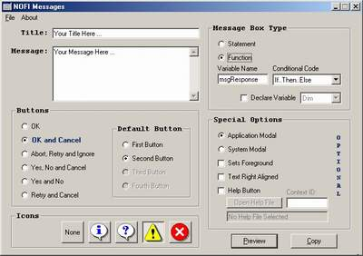



## NOFI Messages

### Description

NOFI Messages is an easiest-to-use small utility that helps you to save the Message Box of your choice. You can Copy the Syntex for the MsgBox function of any Message Box to the Clipboard which can be used while coding your application in Microsoft Visual Basic.

Your comments will help me to improve. Please vote for my code if you find it usefull.
 
### More Info
 
VB Code.

             |
---                |---
**Submitted On**   |2001-04-23 06:20:32
**By**             |[Irfan ul Haq Farooqi](https://github.com/Planet-Source-Code/PSCIndex/blob/master/ByAuthor/irfan-ul-haq-farooqi.md)
**Level**          |Beginner
**User Rating**    |5.0 (15 globes from 3 users)
**Compatibility**  |VB 5\.0, VB 6\.0
**Category**       |[VB function enhancement](https://github.com/Planet-Source-Code/PSCIndex/blob/master/ByCategory/vb-function-enhancement__1-25.md)
**World**          |[Visual Basic](https://github.com/Planet-Source-Code/PSCIndex/blob/master/ByWorld/visual-basic.md)
**Archive File**   |[NOFI Messa187064222001\.zip](https://github.com/Planet-Source-Code/irfan-ul-haq-farooqi-nofi-messages__1-22618/archive/master.zip)

